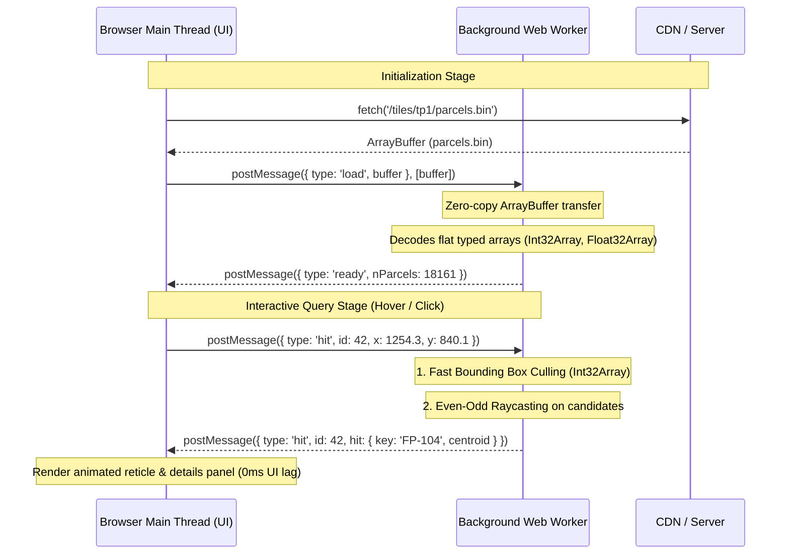
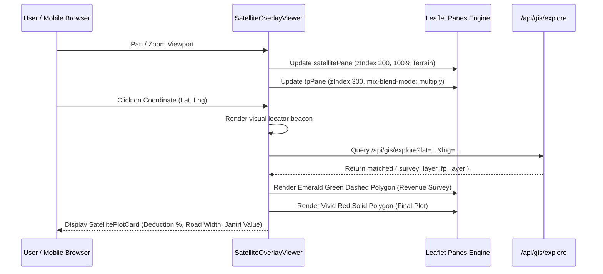

# 🏛️ DholeraMap: Binary Spatial Serialization & Web Worker Pipeline

This document details the engineering specifications of the **`DPB1` binary parcel format**, off-main-thread spatial hit-testing, and tile pyramid streaming powering **[DholeraMap.com](https://dholeramap.com)**.

---

## 1. The Engineering Challenge: Browser Spatial Scale

In the Dholera Special Investment Region (DSIR), Town Planning schemes (TP 1 through TP 6) encompass **18,161 cadastral parcels** distributed across 22 revenue villages. 

### Why Standard Web GIS Stalls
* **GeoJSON Overhead:** Storing 18,161 polygon rings with coordinate arrays in GeoJSON creates **over 50MB of raw text**.
* **Main-Thread Parse Cost:** Parsing a 50MB JSON string freezes the browser's JavaScript event loop for 1.8 to 3.2 seconds.
* **DOM Allocation Limits:** Creating tens of thousands of SVG `<path>` elements or attaching event listeners to each polygon induces severe memory thrashing and drops framerates to single digits during map panning.

---

## 2. The `DPB1` Custom Binary Format

To achieve instant loading and sub-millisecond interaction, cadastral vectors are compiled into an optimized binary format called **`DPB1`** (`parcels.bin`).

### Binary Layout (Little-Endian)
```
+-----------------------------------------------------------------------------------+
| HEADER (28 Bytes)                                                                 |
|   magic: "DPB1" (4B ASCII)                                                        |
|   canvas: [width, height] (2x Float32 = 8B)                                       |
|   nParcels: Uint32 (4B)                                                           |
|   nVertices: Uint32 (4B)                                                          |
|   nStrings: Uint32 (4B)                                                           |
|   coordScale: Float32 (4B)                                                        |
+-----------------------------------------------------------------------------------+
| STRINGS TABLE                                                                     |
|   nStrings records x [uint16 length + utf-8 bytes]                                |
+-----------------------------------------------------------------------------------+
| PARCEL RECORDS (nParcels x 44 Bytes)                                              |
|   origin: [ox, oy] (2x Int32 = 8B)                                                |
|   bbox: [minX, minY, maxX, maxY] (4x Int32 = 16B)                                 |
|   voff: Uint32 (4B) - Offset into vertex array                                    |
|   vcount: Uint16 (2B) - Vertex count                                              |
|   flags: Uint16 (2B) - Attributes (e.g. isEstimated)                              |
|   keyIndex: Uint32 (4B) - Index into strings table                                |
|   centroid: [cx, cy] (2x Float32 = 8B)                                            |
+-----------------------------------------------------------------------------------+
| VERTEX ARRAY (nVertices x 8 Bytes)                                                |
|   nVertices records x [dx: Int32, dy: Int32]                                      |
+-----------------------------------------------------------------------------------+
```

### Delta Encoding & Compression
Instead of storing absolute floating-point coordinates (which require 16 bytes per vertex for `[float64, float64]`), vertices are stored as **Int32 deltas (`dx`, `dy`)** relative to the previous point starting from the parcel's integer origin. 

A vertex coordinate is reconstructed in the worker via:
$$\text{pos}_x = \frac{\text{origin}_x + \sum_{k=0}^{i} \Delta x_k}{\text{coordScale}}$$
$$\text{pos}_y = \frac{\text{origin}_y + \sum_{k=0}^{i} \Delta y_k}{\text{coordScale}}$$

This delta-int32 scheme compresses the vertex payload by **over 80%** compared to GeoJSON.

---

## 3. Web Worker Hit-Testing Architecture

To guarantee 60fps pan/zoom responsiveness without frame drops, spatial point-in-polygon hit-testing is offloaded entirely from the browser's main thread to a dedicated background worker (`parcels-worker.ts`).



### Point-in-Polygon Raycasting
When a hit query `(x, y)` arrives at the worker:
1. **Bounding Box Pre-Culling:** Evaluates candidates against flat `Int32Array` bounding boxes. Any parcel where `x < minX || x > maxX || y < minY || y > maxY` is culled instantly.
2. **Even-Odd Raycasting:** For intersecting bounding boxes, the worker casts a ray from `(x, y)` horizontally and counts edge intersections.
3. **Zero Allocations:** Because the worker operates directly over pre-allocated typed arrays, queries execute in sub-millisecond time with zero per-click garbage collection pauses.

---

## 4. Deep-Zoom Raster Tile Pyramids

- **Source:** Statutory Town Planning blueprints (TP 1 through TP 6).
- **Format:** Multi-resolution Z-X-Y WebP tile pyramids.
- **Client Rendering:** Leaflet viewer with custom non-projected coordinate space (CRS.Simple / custom bounds).
- **Bandwidth Optimization:** The browser only loads the exact $256 \times 256$ WebP tiles required for the active screen viewport, keeping initial load payloads under 400KB.

---

## 5. Dual-Pane Live Satellite Overlay & Orthorectified Raster Stack

To bridge theoretical town planning CAD blueprints with real-world topography, DholeraMap superimposes statutory vector and raster layers directly over live, high-resolution satellite imagery.

### Dual-Pane Architecture & GPU Blending
Traditional web mapping engines render layers in a single flat DOM stack, which either hides the terrain under opaque vector fills or washes out fine cadastral linework when transparency is applied uniformly. 

DholeraMap creates two distinct Leaflet hardware panes:
1. **`satellitePane` (zIndex: 200):** Holds sub-meter orthorectified aerial photography (Google Hybrid, Copernicus Sentinel-2, or Carto Voyager). Rendered at $100\%$ full brightness to preserve terrain clarity.
2. **`tpPane` (zIndex: 300):** Hosts statutory Town Planning (TP 1–6) schemes, Development Plan (DP 2040) zoning boundaries, and village borders.
3. **Hardware CSS Blending:** Applied via `tpPane.style.mixBlendMode = 'multiply'`. Black cadastral boundary lines, road markers, and survey annotations remain crisp and legible, while colored zoning fills dynamically blend with real physical features below — such as the **₹91,000 Cr Tata Semiconductor Fab**, canal corridors, and village roads.



### Geodetic Control & Sub-Centimeter Ground Truth Calibration
- **Source Geodesy:** Project blueprints originate in **WGS 1984 UTM Zone 43N (EPSG:32643)** in meters.
- **Client Rendering:** Transformed to **WGS 84 (EPSG:4326)** decimal degrees with geodesic distance calculations handled via Turf.js ellipsoidal math.
- **GCP Ground-Truth Origin:** Calibrated using Dual-Frequency RTK / Differential GPS (DGPS) survey monuments tied directly to **Survey of India (SOI) GTS benchmarks**, keeping root-mean-square georeferencing error below $0.15\text{m}$.

---

## 6. Summary of Real Technical Achievements

1. **Building Upon Live Satellite Overlays:** Superimposing statutory cadastral linework over sub-meter satellite terrain with dual Leaflet panes and GPU-accelerated `mix-blend-mode: multiply`.
2. **Zero-Copy Memory Handshake:** Using Transferable ArrayBuffers to decouple heavy spatial data from the UI thread.
3. **Custom Binary Protocol (`DPB1`):** Replacing 50MB+ of verbose JSON with a 44-byte struct-aligned binary protocol.
4. **Instant Reverse Spatial Exploration:** Simultaneous dual-polygon vector rendering (ancestral survey boundary vs reconstituted urban plot).
5. **Regulatory Automation:** Encoding Gujarat's DGDCR 2024 building envelope rules (Base FSI, Chargeable FSI, Setbacks) into an instant client-side calculation engine.
6. **OP $\to$ FP Reconstitution:** Direct cross-referencing between historical agricultural survey numbers and modern statutory town planning plots.

