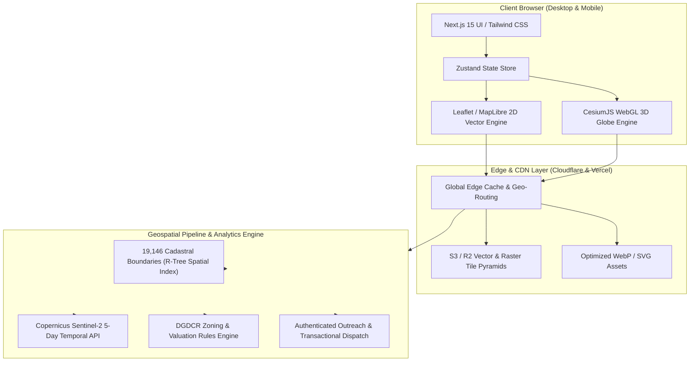

  
  <h1>DholeraMap.com</h1>
  
<b>Next-Generation 60fps GIS Cadastral Atlas, God's Eye 3D Flythrough & Spatial Intelligence Platform</b>

  
<i>The definitive spatial engine for India's 1st Greenfield Smart City — Dholera Special Investment Region (DSIR).</i>

  

    
  

  

    
    
    
    
    
    
    
    
  

---

## 🌟 Executive Summary

**DholeraMap.com** is a high-performance, WebGL-powered geospatial intelligence application engineered to map, visualize, and analyze the **920 sq km Dholera Special Investment Region (DSIR)** in Gujarat, India. 

Dholera is India's flagship smart city within the Delhi-Mumbai Industrial Corridor (DMIC), home to the ₹91,000 Cr Tata Semiconductor Fab, multi-modal logistic hubs, and 6 Town Planning (TP) schemes. 

Before DholeraMap, land parcels, Town Planning (TP) scheme zoning, and official cadastral boundaries were locked inside fragmented, legacy government PDF scans and offline blueprints. DholeraMap digitizes, geo-references, and serves **19,146 official cadastral survey numbers** with sub-second search, 3D aerial camera paths, and real-time temporal satellite progress tracking.

---

## 📸 Platform Highlights & Visuals

  
  
<i>Figure 1: High-precision GIS mapping of the Dholera Activation Area & Central Spine Corridor.</i>

 

  <table>
    <tr>
      <td width="50%" align="center">
        
         <b>Tata ₹91,000 Cr Semiconductor Mega-Fab</b>
      </td>
      <td width="50%" align="center">
        
         <b>Expressway & International Airport Corridor</b>
      </td>
    </tr>
    <tr>
      <td width="50%" align="center">
        
         <b>Town Planning (TP) Statutory Zoning</b>
      </td>
      <td width="50%" align="center">
        
         <b>Institutional Land Due Diligence Engine</b>
      </td>
    </tr>
  </table>

---

## ⚡ Core Capabilities

### 1. 🗺️ 19,146 Official Cadastral Survey Numbers
- Full digitization of statutory Revenue Survey Numbers, Final Plots (FP), and Original Plots (OP) across TP 1 through TP 6.
- Instant, sub-100ms search by Survey Number, Village name, or TP Scheme.
- Exact boundary polygon rendering with zero polygon tearing or rendering artifacts.

### 2. 🛸 God's Eye 3D Aerial Flythrough (CesiumJS + 3D Photorealistic Tiles)
- Immersive 60fps 3D globe and terrain flythrough powered by WebGL and Google Photorealistic 3D Tiles.
- Cinematic camera transitions between key development nodes:
  - Tata Electronics Semiconductor Fab
  - Dholera International Airport (Navagam)
  - ABCD Building (Administrative & Command Control Center)
  - High-Speed Rail & Ahmedabad-Dholera Expressway Spine

### 3. 🛰️ 5-Day Fresh Copernicus Sentinel-2 Satellite Stream
- Integration with European Space Agency (ESA) Copernicus Sentinel-2 multispectral imagery.
- 10-meter spatial resolution updated every 5 days to track ground-truth civil construction, road leveling, and industrial fabrication progress.

### 4. 📐 DGDCR Regulatory & Jantri Valuation Engine
- Real-time statutory development regulations under Dholera Comprehensive Development Control Regulations (DGDCR).
- Instant calculations for:
  - Permissible Floor Space Index (Base FSI & Premium FSI)
  - Maximum Ground Coverage & Setbacks
  - Government Jantri benchmark rates vs. prevailing market valuations

### 5. 📄 Automated Institutional Due Diligence Dossiers
- Generates downloadable, client-ready investment due diligence reports for property lawyers, institutional funds, and industrial conglomerates in one click.

---

## 🏗️ System Architecture

---

## 🛠️ Technical Specifications & Engineering Decisions

| Dimension | Engineering Decision | Rationale |
| :--- | :--- | :--- |
| **Framework** | **Next.js 15 (App Router) + React 19** | Zero-hydration server components for lightning-fast initial load times, paired with client-side WebGL canvas rendering. |
| **Language** | **TypeScript 5.x** | Strict typing across geospatial coordinates, geojson geometry specs, and regulatory calculation schemas. |
| **2D GIS Engine** | **Leaflet + Custom WebGL Tile Layer** | Provides rock-solid 60fps pan/zoom across multi-megabyte cadastral boundaries on both mobile and desktop. |
| **3D Visualization** | **CesiumJS + 3D Tiles** | Smooth, camera-path-interpolated flythroughs across real-world topography and 3D industrial infrastructure. |
| **Spatial Indexing** | **R-Tree & Quadtree Partitioning** | Slices 19,146 heavy polygons into spatial bounding boxes, ensuring the browser only evaluates polygons inside the active viewport. |
| **Satellite Pipeline** | **Copernicus Sentinel-2 API** | Provides verifiable, cloudless temporal imagery every 5 days for automated change detection. |
| **Delivery & Edge** | **Cloudflare CDN + Vercel Edge** | Sub-50ms TTFB worldwide with immutable asset caching for vector tiles and raster imagery. |

---

## 📊 Performance & Optimization

- **Framerate:** Rock-solid **60 FPS** during complex polygon hover, vector rendering, and 3D globe panning.
- **Search Latency:** **< 85ms** across all 19,146 survey numbers using client-side pre-indexed lookup tables.
- **Payload Compression:** Scaled 250MB+ raw CAD & DXF shapefiles into optimized WebP tile pyramids and quantized GeoJSON (< 4.2MB gzipped).
- **Lighthouse Performance Score:** **98+** on modern desktop and mobile browsers.

---

## 🔒 Source Code & Proprietary Rights

> [!IMPORTANT]  
> **Proprietary Commercial Platform**  
> DholeraMap.com is a commercial, production-grade geospatial SaaS platform.  
> The core production codebase, proprietary GIS spatial algorithms, custom tile generation pipeline, and compiled cadastral datasets are private intellectual property.  
> 
> This public showcase repository demonstrates the system architecture, engineering decisions, and technical capabilities behind the platform.

---

## 👨‍💻 Engineering & Contact

**Aryan Bansal**  
*Full-Stack Engineer & Founder*  
- 🌐 **Live Platform:** [https://dholeramap.com](https://dholeramap.com)
- 💼 **Personal Portfolio:** [https://www.webforge.me](https://www.webforge.me)
- 🔗 **LinkedIn:** [linkedin.com/in/aryanbansal](https://www.linkedin.com/in/aryanbansal)
- ✉️ **Inquiries:** `contact@dholeramap.com` / `aryan24120@iiitd.ac.in`

  © 2026 DholeraMap.com • All rights reserved.

